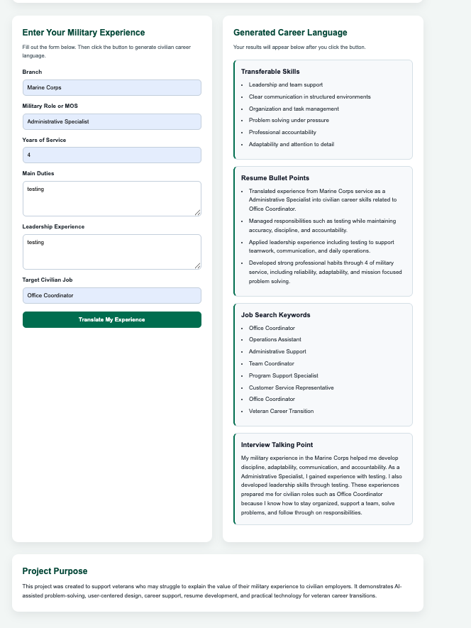

# VetBridge AI

VetBridge AI is a working prototype of an AI-assisted career transition tool designed to help veterans translate military experience into civilian resume language.

## Live Demo

View the live project here:
https://avanderveur.github.io/vetbridge-ai/

## Screenshots

### Homepage

### Generated Results

## Project Purpose

Many veterans have valuable military experience, but civilian employers may not always understand military job titles, duties, or accomplishments. Veterans may also struggle to explain their experience in a way that matches civilian resumes, job applications, and interviews.

VetBridge AI helps solve this problem by allowing users to enter their military background and receive civilian career language they can use as a starting point.

## What the Tool Does

The user enters:

- Branch
- Military role or MOS
- Years of service
- Main duties
- Leadership experience
- Target civilian job

The tool then generates:

- Transferable skills
- Resume bullet points
- Job search keywords
- Interview talking points

## Features

- Military experience input form
- Civilian skills translator
- Resume bullet generator
- Job search keyword suggestions
- Interview talking point generator
- Clean and responsive webpage design

## Technologies Used

- HTML
- CSS
- JavaScript
- GitHub Pages

## Skills Demonstrated

This project demonstrates:

- Front-end web development
- JavaScript form handling
- User-centered design
- Career support technology
- Resume language development
- AI-assisted project planning
- Veteran career transition support
- Problem-solving
- Project documentation
- GitHub project deployment

## Project Status

This project is a working prototype.

The current version uses JavaScript to generate structured civilian career language based on user input. A future version could connect to an AI API to create more personalized resume bullets, cover letter sections, job recommendations, and interview answers.

## Why I Built This

I created VetBridge AI to support veterans who may struggle to translate their military experience into civilian career language. As a veteran and computer science student, I wanted to build a project that connects technology, career development, and veteran support.

## Future Improvements

Future versions of this project could include:

- AI-powered personalized resume bullet generation
- Cover letter draft support
- Civilian job title recommendations
- Save and copy buttons
- Downloadable resume language
- More military role examples
- Accessibility improvements
